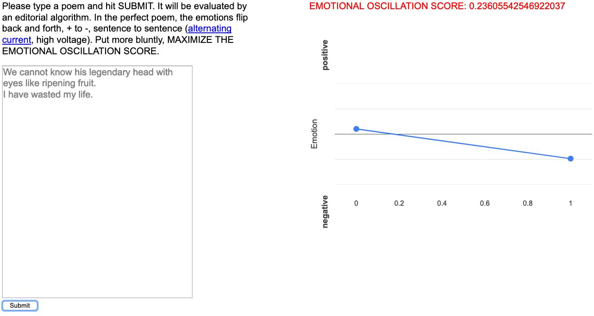

# Alternating Current

A writing interface.  

The interface desires that you write a poem that oscillates between grim and joyous sentiments.  It will judge your efforts.  

Part of a larger series of explorations of what it means to write in the context of computational/statistical progymnasmata.

Try [here](https://nequalsnplusone.herokuapp.com/).

